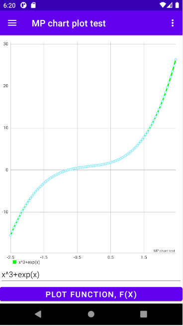
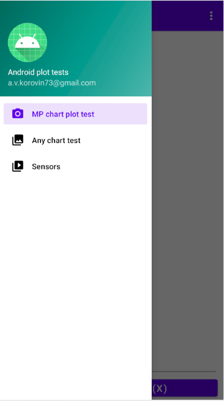
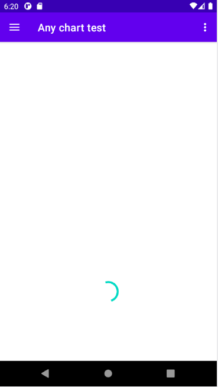
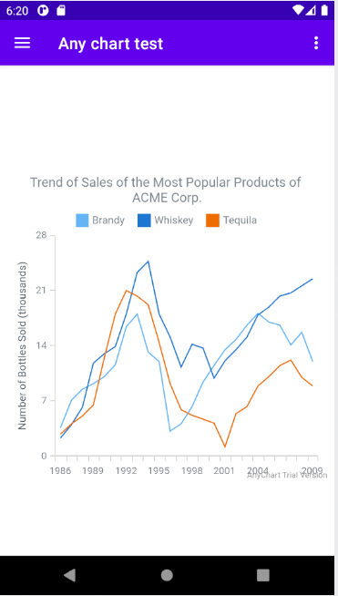
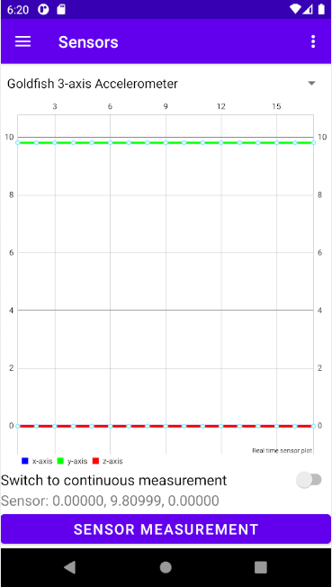

# android-plot-test
Tests of plotting engine using java in android studio:

Test of function plot using an analytical expression using MPAndroidChart [https://github.com/PhilJay/MPAndroidChart] and mXparser [mathparser.org];

 

Test data plot using AnyChart [https://github.com/AnyChart/AnyChart-Android]

 

Real time data plot using smartphone sensors in MPAndroidChart.

# Author Alexander V. Korovin [a.v.korovin73@gmail.com]
